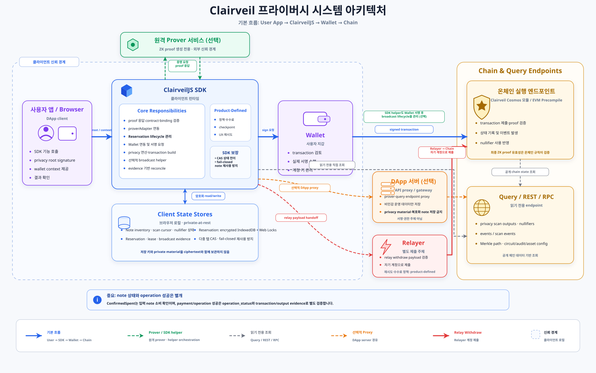
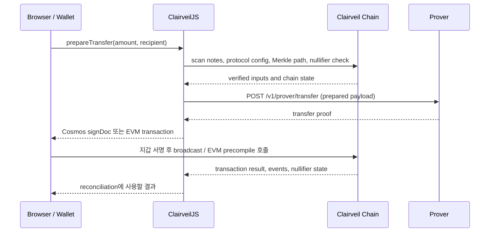
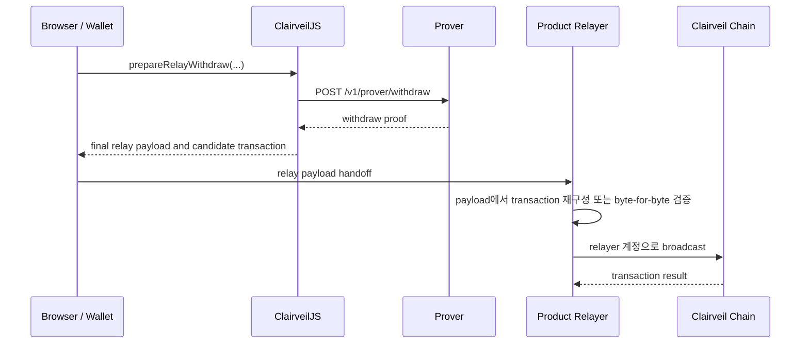

# ClairveilJS 시스템 아키텍처

## 목적과 범위

이 문서는 ClairveilJS를 사용하는 브라우저 DApp에서 **지갑/브라우저**, **ClairveilJS**, **prover 서비스**, **선택적 DApp 서버 또는 relayer**, **Clairveil 온체인 모듈**이 맡는 책임과 통신 경로를 설명한다.

ClairveilJS의 `src/` 디렉터리 계층은 구현 구조를 설명하지만, 이 문서는 실제 서비스 배포와 런타임 상호작용을 다룬다. Cosmos와 Clairveil-compatible EVM 체인을 모두 포함하며, 배포 환경에 따라 선택되는 경로를 구분한다.

지원하는 기준 protocol은 Clairveil v0.3.1 SDK handoff(`621c24a`)의
`privacy-note-v1` / `privacy-fixed-v1`이다. 해당 source의 공개 상태는
`PUBLICATION_READY_EXPERIMENTAL`이며 production 배포 승인이 아니다. Formal
trusted setup, 외부 security/circuit audit, signed production artifact와 target
chain/product 검증은 이 아키텍처 밖의 별도 release gate다.

Note의 예약·증명·제출·재조정 상태는 [Note Reservation 상태 전이](./reservation-state-machine.ko.md) 문서에서 별도로 다룬다.

SDK 메서드가 실제 chain REST/RPC, prover HTTP, Cosmos Msg, EVM precompile로 이어지는 세부 계약은 [API 매핑](./api-mapping.ko.md) 문서에서 다룬다.

배포 profile, endpoint와 timeout은 [설정 가이드](./configuration.ko.md), 암호화 wallet DB와 reservation 영속화는 [저장소·영속성 가이드](./storage-and-persistence.ko.md), 오류 형태와 재시도·reconcile 기준은 [오류·복구 가이드](./errors-and-recovery.ko.md)에서 다룬다.

## 컴포넌트와 신뢰 경계



파란색은 기본 사용자 서명 흐름, 초록색은 선택적 remote prover와 SDK broadcast helper, 회색은 read-only query, 주황색은 선택적 DApp proxy, 빨간색은 relay withdraw 경로다. 점선 테두리 안은 브라우저의 wallet-controlled client trust boundary이며, Prover·DApp 서버·Relayer·chain endpoint는 그 밖의 주체다.

다이어그램은 `npm run docs:diagram:architecture`로 의도적으로 다시 생성한 뒤 결과 SVG를 커밋한다. 빌드나 package install에서는 자동 생성하지 않는다. `npm run docs:diagram:check`는 커밋된 SVG를 덮어쓰지 않고 생성 결과와 같은지만 확인한다.

| 컴포넌트 | 책임 | 보관하거나 처리하면 안 되는 값 |
| --- | --- | --- |
| 브라우저 / Wallet | 사용자의 privacy root signature로부터 privacy material을 유도하고, 노트를 스캔하며, 준비된 transaction을 서명한다. | 일반 DApp 서버에 privacy root signature, root seed, spend/view/disclosure private material, 복호화한 note를 전달하면 안 된다. |
| ClairveilJS | 클라이언트에서 note scan, planner, Merkle path/nullifier 검증, transfer·withdraw payload 구성, prover adapter 호출, Cosmos sign doc 또는 EVM transaction 구성을 수행한다. ZK proof를 자체 생성하지는 않는다. Note 영속화는 주입된 Note Store에 맡기며, SDK의 `LocalStorageNoteStore`는 명시적 opt-in 시 복호화 note를 평문 저장한다. | private material을 임의의 서버로 자동 전송하지 않는다. Production에서는 plaintext `LocalStorageNoteStore`를 사용하지 않고 앱·지갑의 암호화 Note Store를 주입한다. |
| Prover 서비스 | ClairveilJS가 보낸 준비된 prover payload로 transfer, withdraw 또는 batch ZK proof를 생성해 응답한다. Batch는 Cosmos `MsgBatchTransfer` 전용이며 Deposit은 별도의 exact `depositProofUrl` 또는 주입한 provider를 사용한다. | 신뢰되지 않은 prover에 private payload/proof를 넘기면 안 된다. 원격 prover를 쓸지, local/WASM prover를 쓸지는 제품의 신뢰 모델이 결정한다. Automatic cross-endpoint failover는 기본 비활성화다. |
| Client State Stores | Note store는 scan 결과·cursor·nullifier 상태를, Reservation store는 inventory lock·lease·broadcast evidence를 보존한다. Production browser의 Reservation store는 암호화된 IndexedDB와 Web Locks를 사용한다. | 로컬 저장소이며 서버 저장소가 아니다. private material에서 유도한 암호화 키를 ciphertext와 함께 저장하면 안 된다. |
| DApp Proxy | 기본 아키텍처에서는 필수가 아니다. 필요한 경우 chain REST/RPC, prover HTTP 또는 broadcast endpoint를 프록시한다. | 일반 production 경로에서 사용자 privacy material이나 복호화 note의 보관 주체가 되면 안 된다. |
| Product Relayer | relay withdraw payload를 검증하고 relayer 자신의 Cosmos/EVM 계정으로 제출한다. 제품별 인증·수수료·정책은 SDK 공통 계약이 아니다. | 클라이언트가 준 candidate transaction을 검증 없이 제출하면 안 된다. |
| Chain REST / RPC Endpoint | scan/config/Merkle path/nullifier 조회와 transaction broadcast의 네트워크 진입점이다. | wallet private key나 privacy root material을 요구하면 안 된다. |
| Clairveil 온체인 | Cosmos privacy module 또는 EVM `IPrivacy` precompile에서 proof와 transaction 규칙을 검증하고 상태·event를 갱신한다. EVM precompile의 구현·배포 책임은 ClairveilJS가 아니라 target/downstream chain에 있다. | 오프체인 지갑의 private material을 알 필요가 없다. |

## 기본 배포 모델

Production DApp의 기본 모델은 **브라우저가 ClairveilJS를 직접 실행**하는 구조다.

```text
Browser + ClairveilJS
  ├─ HTTPS → prover URL
  ├─ HTTPS → chain REST endpoint (scan, config, Merkle path, nullifier query)
  ├─ Production note store → 앱·지갑이 제공하는 별도 암호화 wallet DB
  ├─ IndexedDB + Web Locks → 암호화된 reservation 상태
  ├─ Wallet → Cosmos signDirect 또는 EIP-1193 승인
  └─ RPC / wallet provider → 서명·승인된 transaction 제출
```

따라서 public node DApp은 privacy transaction 준비만을 위해 별도 Clairveil application server를 둘 필요가 없다. 서버를 둔다면 CORS, endpoint proxy, 운영용 도구 또는 relay 같은 명시적인 책임이 있어야 한다.

`signDirectAndBroadcast(...)`, `broadcastSignedTx(...)`, `sendEvmTransaction(...)` 같은 SDK helper가 broadcast lifecycle을 관리할 수 있지만, transaction 권한은 wallet 또는 relayer에 있다. 문서와 다이어그램에서는 read query와 서명·제출 경계를 별도로 표현한다.

## 클라이언트 상태와 저장소

Note store는 chain scan 결과와 nullifier 확인 상태를 보관한다. SDK가 제공하는 `LocalStorageNoteStore`는 복호화된 note를 `localStorage`에 평문 JSON으로 저장하며, `allowPlaintext: true`를 명시해야만 사용할 수 있는 demo/test 전용 구현이다. Production에서는 같은 note store contract를 구현하는 별도의 암호화 wallet DB를 앱 또는 지갑 계층에서 제공해야 한다.

Reservation store는 선택된 note의 inventory lock, worker lease, payload/proof binding, broadcast attempt와 reconciliation evidence를 별도로 보관한다. Production browser에서는 `createBrowserReservationStore(...)`가 IndexedDB를 사용하며, 다중 tab이 같은 note를 동시에 예약하지 않도록 Web Locks를 요구한다. 전체 reservation state에는 amount, transaction evidence, timestamp 같은 metadata가 포함되므로 `encodeState`/`decodeState`로 at-rest 암호화를 적용해야 한다. Memory fallback과 plaintext 저장은 demo/test 전용 명시적 opt-in이다.

Namespace 분리, 암호화 envelope, Note Store adapter, scan cursor/reorg, key rotation과 재시작 복구의 구현 기준은 [저장소·영속성 구현 가이드](./storage-and-persistence.ko.md)를 따른다.

## 배포 형태

| 형태 | 경로 | 용도 |
| --- | --- | --- |
| Direct public-node DApp | Browser → Prover / Chain REST·RPC / Wallet | Production 기본 모델 |
| Endpoint proxy | Browser → DApp Proxy → Prover 또는 Chain endpoint | CORS, routing, 운영 정책이 필요한 경우 |
| Local/WASM prover | Browser 내부 prover adapter | prover payload를 외부 서비스에 보내지 않는 신뢰 모델 |
| Relay withdraw | Browser → Product Relayer → Chain | 사용자가 직접 withdraw transaction을 제출하지 않는 제품 흐름 |

## Prover 호출 구조

`createHttpProverAdapter({ baseURL })`는 아래 HTTP 계약을 제공한다.

| SDK adapter 메서드 | HTTP 요청 | 사용하는 흐름 |
| --- | --- | --- |
| `proveTransfer(...)` | `POST {baseURL}/v1/prover/transfer` | transfer 준비 |
| `proveWithdraw(...)` | `POST {baseURL}/v1/prover/withdraw` | direct withdraw와 relay withdraw 준비 |
| `proveBatchTransfer(...)` | `POST {baseURL}/v1/proofs/batch-transfer` | Cosmos one-proof batch transfer 준비 |

브라우저 클라이언트에 `proverUrl`을 주고 별도의 `proverAdapter`를 주입하지 않으면 ClairveilJS는 이 HTTP adapter를 생성한다. 즉 기본 경로는 **브라우저의 ClairveilJS가 prover URL을 직접 호출**하는 것이다. `proverUrl`이 DApp 서버 프록시를 가리키는 경우에만 prover 요청이 서버를 경유한다.

`proverUrl`이 DApp proxy를 가리키면 input amount·randomness·Merkle path 등 private witness를 포함하는 prepared prover payload가 그 서버를 통과한다. 이 proxy는 일반 read-only query proxy가 아니라 remote prover와 같은 privacy-sensitive 신뢰 주체로 분류하고, request body logging·analytics·cache를 비활성화해야 한다. 해당 신뢰를 허용할 수 없으면 local/WASM prover를 사용한다.

`/v1/prover/transfer`와 `/v1/prover/withdraw`는 deposit proof endpoint가 아니다. Deposit은 local/WASM `depositProofProvider` 또는 profile에 명시적으로 고정한 `depositProofUrl`을 사용하며, `proverUrl`에서 deposit URL을 추론하지 않는다.

HTTP prover adapter는 response shape, request payload hash와 circuit/artifact identity 같은 계약 binding을 확인한다. ZK proof의 최종 유효성은 Clairveil 온체인 실행 규칙에서 검증된다.

## Deposit 흐름

Deposit은 transfer/withdraw와 proof endpoint가 다르다.

1. ClairveilJS가 wallet privacy material과 deposit note/commitment를 준비한다.
2. 호출자가 제공한 local/WASM `depositProofProvider` 또는 profile에 고정된 `depositProofUrl`에서 DepositCircuit proof를 얻는다.
3. SDK가 Cosmos `MsgDeposit` sign doc 또는 EVM precompile transaction을 구성한다.
4. Wallet이 서명·승인하고 chain endpoint로 제출한다.

`depositProofUrl`은 기본 `proverUrl`에서 파생하지 않는다. Product-hosted endpoint를 사용할 경우 redirect를 허용하지 않고 요청 commitment와 응답 commitment가 정확히 일치해야 한다.

## Transfer 흐름



1. ClairveilJS가 chain REST query를 사용해 노트, protocol config, Merkle path와 nullifier 상태를 확인한다.
2. SDK가 transfer prover payload를 만들고 `proveTransfer(...)`를 호출한다.
3. prover 응답의 계약과 payload binding을 확인한 뒤 Cosmos `MsgTransfer` 또는 EVM precompile transaction을 구성한다.
4. 지갑이 sign doc 또는 EVM transaction을 서명·제출한다.
5. 제출 후에는 온체인 결과와 nullifier/event evidence로 reservation을 reconcile한다.

## Withdraw와 Relay Withdraw 흐름

Direct withdraw는 transfer와 동일하게 note scan과 nullifier 검증 후 `proveWithdraw(...)`를 호출한다. proof를 포함한 Cosmos `MsgWithdraw` 또는 EVM precompile withdraw transaction을 만든 뒤, 사용자의 지갑이 제출한다.

Relay withdraw는 proof 생성 단계까지는 동일하지만, 사용자의 지갑이 직접 broadcast하지 않는다.



Relayer는 클라이언트가 건넨 transaction을 그대로 신뢰해서는 안 된다. payload를 기준으로 `to`, `data`, `chainId`, recipient, expiry, payload hash를 검증하고, Cosmos에서는 relayer-side `MsgWithdraw` signing을 수행한다. relay payload가 외부로 전달된 뒤에는 TTL 만료나 로컬 취소만으로 reservation을 release하지 않고 온체인 상태를 reconcile해야 한다.

## One-Proof Batch Transfer

Experimental one-proof batch transfer는 일반 `/v1/prover/transfer`가 아니라 `/v1/proofs/batch-transfer`를 사용한다. 하나의 operation에서 1~16개 input과 1~32개 output을 원자적으로 처리하므로 모든 input reservation을 같은 lifecycle로 관리해야 한다.

현재 이 흐름은 **Cosmos `MsgBatchTransfer` 전용**이다. EVM profile의 `prepareTransferBatch(...)`는 거부되며 ClairveilJS는 `IPrivacy.batchTransfer` ABI나 EVM batch fallback을 제공하지 않는다. EVM의 일반 `IPrivacy.transfer`는 별개의 native transfer 경로다.

실행 가능한 batch에는 `reservationManager`, `onPreparedPayload`, `onPreparedProof` checkpoint가 필요하다. Checkpoint된 payload와 proof는 private artifact이므로 암호화해 저장하고, 로컬 파일은 mode `0600`을 사용한다. 재시작 복구에서는 저장된 정확한 payload, 원래 operation ID, reservation batch와 proof checkpoint를 사용해야 하며, proof-stage 결과만으로 바로 broadcast하지 않는다. `finalizePreparedBatchTransfer(...)`로 sign doc과 operation evidence를 재구성·검증한 뒤 제출한다.

## Cosmos와 EVM의 온체인 경로

| 구분 | 조회 | 제출 |
| --- | --- | --- |
| Cosmos | REST query로 note scan, Merkle path, nullifier, protocol config를 조회한다. | ClairveilJS가 `MsgDeposit`, `MsgTransfer`, `MsgBatchTransfer` 또는 `MsgWithdraw`를 포함한 sign doc을 만들고, 지갑이나 relayer가 서명한 transaction을 RPC로 broadcast한다. |
| EVM | Clairveil REST로 privacy 상태를 조회하고 read-only `evmRpc`로 chain ID와 transaction receipt 등을 조회한다. | ClairveilJS가 `IPrivacy.deposit`, `IPrivacy.transfer`, `IPrivacy.withdraw` calldata를 만들고 EIP-1193 wallet 또는 relayer가 제출한다. One-Proof batch는 지원하지 않는다. |

EVM profile에서는 proof 또는 prepared transaction을 만들기 전에 연결 지갑의 chain ID와 read-only `evmRpc` chain ID가 profile의 `evmChainId`와 일치하는지 확인해야 한다.

## 운영 원칙

- privacy root signature, root seed, spend/view/disclosure private material, 복호화 note는 브라우저 또는 wallet-controlled runtime에 유지한다.
- prover, relayer, DApp 서버를 신뢰 경계 밖으로 취급한다면 private payload나 proof를 해당 서비스에 보내지 않는다.
- prover URL, chain RPC/REST, EVM RPC, deposit proof URL은 명시적인 profile 또는 배포 설정으로 관리한다.
- SDK 기본 HTTP adapter 대신 사내 인증, queue/poll, local/WASM prover가 필요하면 `proverAdapter`를 주입한다.
- relay withdraw와 broadcast 이후에는 transaction hash, nullifier 상태, event evidence를 근거로 상태를 reconcile한다.

## 구현 참조

- HTTP prover adapter와 endpoint 경로: `src/privacy/prover.js`
- transfer/withdraw proof 호출: `src/privacy/payload.js`
- browser client의 `proverUrl` 기본 adapter 생성: `src/browser/wallet-client.js`
- Cosmos transfer/withdraw/relay withdraw 준비: `src/transport/cosmos-client.js`
- EVM precompile transaction 구성: `src/transport/evm.js`
