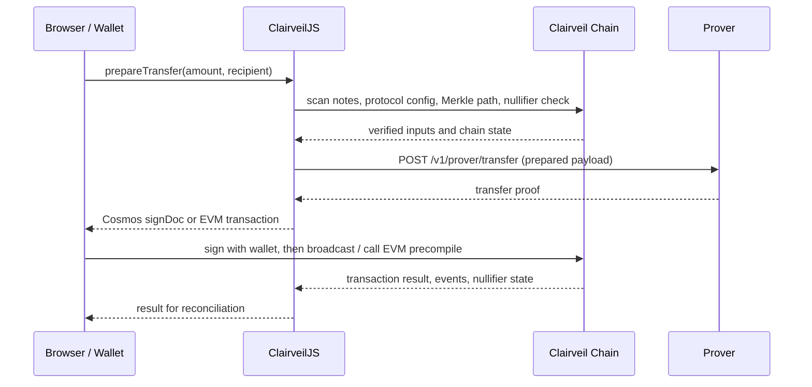
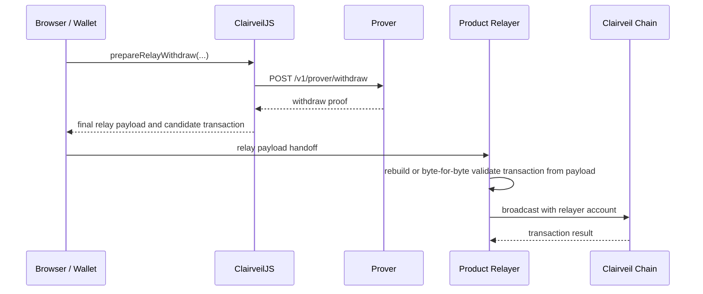

# ClairveilJS System Architecture

## Purpose and scope

This document explains the responsibilities and communication paths among the **wallet/browser**, **ClairveilJS**, the **prover service**, an **optional DApp server or relayer**, and the **Clairveil on-chain module** in a browser DApp that uses ClairveilJS.

The `src/` directory hierarchy explains the implementation structure, but this document focuses on real service deployment and runtime interactions. It covers both Cosmos and Clairveil-compatible EVM chains and distinguishes the path selected by the deployment environment.

The supported protocol baseline is the Clairveil v0.3.1 SDK handoff (`0ff9283`) `privacy-note-v1` / `privacy-fixed-v1`. The public status of that source is `PUBLICATION_READY_EXPERIMENTAL`, not production deployment approval. Formal trusted setup, external security/circuit audit, signed production artifacts, and target chain/product validation are separate release gates outside this architecture.

Note reservation, proving, submission, and reconciliation states are covered separately in [Note Reservation State Transitions](./reservation-state-machine.md).

The detailed contracts connecting SDK methods to chain REST/RPC, prover HTTP, Cosmos messages, and EVM precompiles are covered in [API mapping](./api-mapping.md).

Deployment profiles, endpoints, and timeouts are covered in the [Configuration guide](./configuration.md); encrypted wallet databases and reservation persistence are covered in [Storage and persistence](./storage-and-persistence.md); error forms, retry decisions, and reconciliation criteria are covered in the [Errors and recovery guide](./errors-and-recovery.md).

## Components and trust boundaries


Blue is the default user-signing flow, green is the optional remote prover and SDK broadcast helper, gray is a read-only query, orange is an optional DApp proxy, and red is the relay-withdraw path. The dotted boundary is the browser's wallet-controlled client trust boundary; the Prover, DApp server, Relayer, and chain endpoint are outside it.

The diagram is intentionally regenerated with `npm run docs:diagram:architecture`, and the resulting SVG is committed. It is not generated automatically during build or package install. `npm run docs:diagram:check` verifies that the committed SVG matches the generated result without overwriting it.

| Component | Responsibility | Values it must not store or process |
| --- | --- | --- |
| Browser / Wallet | Derives privacy material from the user's privacy-root signature, scans notes, and signs prepared transactions. | Never send the privacy-root signature, root seed, spend/view/disclosure private material, or decrypted notes to a general DApp server. |
| ClairveilJS | Performs note scanning, planning, Merkle path/nullifier verification, transfer/withdraw payload construction, prover-adapter calls, and Cosmos sign-doc or EVM transaction construction on the client. It does not generate ZK proofs itself. Note persistence is delegated to the injected Note Store; the SDK's `LocalStorageNoteStore` stores decrypted notes in plaintext only with explicit opt-in. | Does not automatically send private material to arbitrary servers. In production, do not use a plaintext `LocalStorageNoteStore`; inject an encrypted Note Store supplied by the app or wallet. |
| Prover service | Generates transfer, withdraw, or batch ZK proofs from the prepared prover payload sent by ClairveilJS. The same batch proof maps to either Cosmos `MsgBatchTransfer` or EVM `singleProofBatchTransfer`; Deposit uses a separate exact `depositProofUrl` or injected provider. | Do not send private payloads/proofs to an untrusted prover. Whether to use a remote prover or a local/WASM prover is determined by the product's trust model. Automatic cross-endpoint failover is disabled by default. |
| Client State Stores | The Note Store retains scan results, cursors, and nullifier state; the Reservation Store retains inventory locks, leases, and broadcast evidence. A production browser Reservation Store uses encrypted IndexedDB and Web Locks. | These are local stores, not server stores. Do not store encryption keys derived from private material alongside the ciphertext. |
| DApp Proxy | Not required by the default architecture. When needed, proxies chain REST/RPC, prover HTTP, or broadcast endpoints. | Must not become the storage owner for user privacy material or decrypted notes on the normal production path. |
| Product Relayer | Validates relay-withdraw payloads and submits them using the relayer's own Cosmos/EVM account. Product-specific authentication, fees, and policies are not common SDK contracts. | Must not submit a candidate transaction from the client without validation. |
| Chain REST / RPC Endpoint | Network entry point for scan/config/Merkle path/nullifier queries and transaction broadcast. | Must not request wallet private keys or privacy-root material. |
| Clairveil on chain | The Cosmos privacy module or EVM `IPrivacy` precompile verifies proof and transaction rules and updates state/events. Deployment and implementation of the EVM precompile belong to the target/downstream chain, not ClairveilJS. | Has no need to know the off-chain wallet's private material. |

## Default deployment model

The default production DApp model is **the browser running ClairveilJS directly**.

```text
Browser + ClairveilJS
  ├─ HTTPS → prover URL
  ├─ HTTPS → chain REST endpoint (scan, config, Merkle path, nullifier query)
  ├─ Production note store → separate encrypted wallet DB provided by the app/wallet
  ├─ IndexedDB + Web Locks → encrypted reservation state
  ├─ Wallet → Cosmos signDirect or EIP-1193 approval
  └─ RPC / wallet provider → submission of signed/approved transactions
```

Therefore, a public-node DApp does not need a separate Clairveil application server just to prepare privacy transactions. If a server is added, it should have an explicit responsibility such as CORS handling, endpoint proxying, operations tooling, or relaying.

SDK helpers such as `signDirectAndBroadcast(...)`, `broadcastSignedTx(...)`, and `sendEvmTransaction(...)` may manage the broadcast lifecycle, but transaction authority belongs to the wallet or relayer. The documentation and diagram show the read-query boundary separately from the signing/submission boundary.

## Client state and stores

The Note Store holds chain scan results and nullifier-confirmation state. The SDK's `LocalStorageNoteStore` stores decrypted notes as plaintext JSON in `localStorage` and is a demo/test-only implementation that requires explicit `allowPlaintext: true`. In production, the app or wallet layer must provide a separate encrypted wallet DB implementing the same Note Store contract.

The Reservation Store separately holds selected-note inventory locks, worker leases, payload/proof bindings, broadcast attempts, and reconciliation evidence. In a production browser, `createBrowserReservationStore(...)` uses IndexedDB and requires Web Locks so multiple tabs do not reserve the same note concurrently. The full reservation state includes metadata such as amounts, transaction evidence, and timestamps, so at-rest encryption must be applied through `encodeState`/`decodeState`. Memory fallback and plaintext storage are explicit demo/test opt-ins only.

Follow the [Storage and persistence implementation guide](./storage-and-persistence.md) for namespace separation, encryption envelopes, Note Store adapters, scan cursor/reorg handling, key rotation, and restart recovery.

## Deployment forms

| Form | Path | Use |
| --- | --- | --- |
| Direct public-node DApp | Browser → Prover / Chain REST·RPC / Wallet | Production default |
| Endpoint proxy | Browser → DApp Proxy → Prover or Chain endpoint | When CORS, routing, or operational policy is needed |
| Local/WASM prover | Prover adapter inside the browser | Trust model that does not send prover payloads to an external service |
| Relay withdraw | Browser → Product Relayer → Chain | Product flows where the user does not submit the withdraw transaction directly |

## Prover call structure

`createHttpProverAdapter({ baseURL })` provides these HTTP contracts.

| SDK adapter method | HTTP request | Flow |
| --- | --- | --- |
| `proveTransfer(...)` | `POST {baseURL}/v1/prover/transfer` | Transfer preparation |
| `proveWithdraw(...)` | `POST {baseURL}/v1/prover/withdraw` | Direct and relay withdraw preparation |
| `proveBatchTransfer(...)` | `POST {baseURL}/v1/proofs/batch-transfer` | Cosmos one-proof batch transfer preparation |

If a browser client receives `proverUrl` without an injected `proverAdapter`, ClairveilJS creates this HTTP adapter. The default path is therefore **the browser's ClairveilJS calling the prover URL directly**. A prover request passes through a DApp server only when `proverUrl` points to a DApp proxy.

When `proverUrl` points to a DApp proxy, the prepared prover payload containing private witnesses such as input amounts, randomness, and Merkle paths passes through that server. Treat this proxy as a privacy-sensitive trust principal like the remote prover, and disable request-body logging, analytics, and caching. Use a local/WASM prover if that trust cannot be accepted.

`/v1/prover/transfer` and `/v1/prover/withdraw` are not deposit-proof endpoints. Deposit uses a local/WASM `depositProofProvider` or an explicitly fixed `depositProofUrl` in the profile; ClairveilJS does not infer a deposit URL from `proverUrl`.

The HTTP prover adapter checks response shape and contract bindings such as the request payload hash and circuit/artifact identity. The final validity of the ZK proof is verified by Clairveil's on-chain execution rules.

## Deposit flow

Deposit uses a different proof endpoint from transfer/withdraw.

1. ClairveilJS prepares the deposit note/commitment and wallet privacy material.
2. It obtains a DepositCircuit proof from the caller-provided local/WASM `depositProofProvider` or the profile's fixed `depositProofUrl`.
3. The SDK constructs a Cosmos `MsgDeposit` sign doc or an EVM precompile transaction.
4. The wallet signs/approves it and submits it to the chain endpoint.

`depositProofUrl` is not derived from the default `proverUrl`. When using a product-hosted endpoint, disallow redirects and require the commitment in the response to match the requested commitment exactly.

## Transfer flow



1. ClairveilJS uses chain REST queries to verify notes, protocol config, Merkle paths, and nullifier state.
2. The SDK builds the transfer prover payload and calls `proveTransfer(...)`.
3. After checking the prover response contract and payload binding, it constructs a Cosmos `MsgTransfer` or EVM precompile transaction.
4. The wallet signs and submits the sign doc or EVM transaction.
5. After submission, reservations are reconciled using on-chain results and nullifier/event evidence.

## Withdraw and relay-withdraw flows

Direct withdraw calls `proveWithdraw(...)` after note scanning and nullifier verification, just like transfer. It creates a Cosmos `MsgWithdraw` or EVM precompile withdraw transaction containing the proof, and the user's wallet submits it.

Relay withdraw shares the same proof-generation stage but does not have the user's wallet broadcast directly.



The relayer must not blindly trust a transaction supplied by the client. It must validate `to`, `data`, `chainId`, recipient, expiry, and payload hash against the payload and perform relayer-side `MsgWithdraw` signing on Cosmos. After a relay payload is sent externally, do not release the reservation based only on TTL expiry or local cancellation; reconcile on-chain state.

## One-Proof Batch Transfer

Experimental one-proof batch transfer uses `/v1/proofs/batch-transfer`, not the ordinary `/v1/prover/transfer`. Because one operation atomically handles 1–16 inputs and 1–32 outputs, all input reservations must share the same lifecycle.

The same One-Proof payload and proof execute as Cosmos `MsgBatchTransfer` or EVM `singleProofBatchTransfer`, according to the active profile. The EVM executor rail may use optional EIP-712 authorization. A single-proof batch and multiple independent transfer transactions are not interchangeable; ordinary EVM `IPrivacy.transfer` remains a separate native-transfer path.

Executable batches require `reservationManager`, `onPreparedPayload`, and `onPreparedProof` checkpoints. Checkpointed payloads and proofs are private artifacts: store them encrypted, and use mode `0600` for local files. Restart recovery requires the exact stored payload, original operation ID, reservation batch, and proof checkpoint; do not broadcast directly from a proof-stage result. Reconstruct and verify the Cosmos sign doc or canonical EVM transaction and operation evidence with `finalizePreparedBatchTransfer(...)` before submission. Recovery accepts only the exact `batch_transfer` reservation set for the original operation while it remains `Proving` under the original lease owner and token, and verifies that its lookup keys match the payload nullifiers. `ManualReview` reservations require operator resolution first.

## On-chain paths for Cosmos and EVM

| | Queries | Submission |
| --- | --- | --- |
| Cosmos | Query note scans, Merkle paths, nullifiers, and protocol config through REST. | ClairveilJS creates a sign doc containing `MsgDeposit`, `MsgTransfer`, `MsgBatchTransfer`, or `MsgWithdraw`, and a wallet or relayer broadcasts the signed transaction over RPC. |
| EVM | Query privacy state through Clairveil REST and chain ID/transaction receipts through read-only `evmRpc`. | ClairveilJS creates `IPrivacy.deposit`, `IPrivacy.transfer`, `IPrivacy.singleProofBatchTransfer`, or `IPrivacy.withdraw` calldata, and an EIP-1193 wallet or relayer submits it. |

In an EVM profile, verify before creating a proof or prepared transaction that the connected wallet's chain ID and the read-only `evmRpc` chain ID both match the profile's `evmChainId`.

## Operational principles

- Keep the privacy-root signature, root seed, spend/view/disclosure private material, and decrypted notes in the browser or wallet-controlled runtime.
- If the prover, relayer, or DApp server is outside the trust boundary, do not send private payloads or proofs to that service.
- Manage the prover URL, chain RPC/REST, EVM RPC, and deposit proof URL through an explicit profile or deployment configuration.
- Inject a `proverAdapter` when you need internal authentication, queue/polling, or a local/WASM prover instead of the SDK's default HTTP adapter.
- After relay withdraw and broadcast, reconcile using the transaction hash, nullifier state, and event evidence.

## Implementation references

- HTTP prover adapter and endpoint paths: `src/privacy/prover.js`
- Transfer/withdraw proof calls: `src/privacy/payload.js`
- Browser client's default adapter creation from `proverUrl`: `src/browser/wallet-client.js`
- Cosmos transfer/withdraw/relay-withdraw preparation: `src/transport/cosmos-client.js`
- EVM precompile transaction construction: `src/transport/evm.js`
