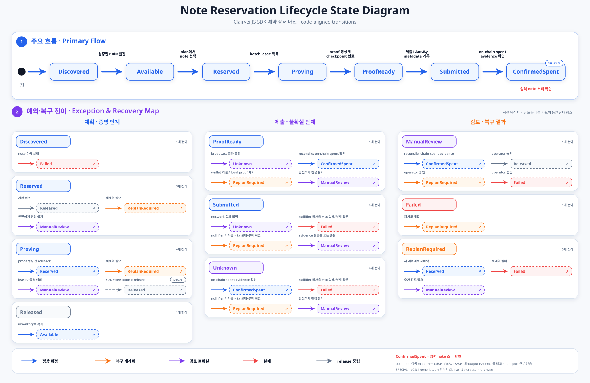

# Note Reservation 상태 전이

## 목적

이 문서는 private note가 scan inventory에 들어온 뒤 계획·증명·제출·재조정되는 전체 사용 lifecycle과, ClairveilJS의 `NoteReservationManager`가 중복 사용을 막기 위해 영속화하는 **reservation 상태**를 함께 설명한다.

`Discovered`와 `Available`은 scan/note inventory 관점의 개념적 사전 상태다. 상태 vocabulary와 전이 계약에는 포함되지만, `reserveNotes(...)`와 `reservePlan(...)`이 만드는 신규 persisted reservation record는 반드시 `Reserved`에서 시작한다. 따라서 실제 Reservation Store의 정상 영속 lifecycle은 `Reserved → Proving → ProofReady → Submitted → ConfirmedSpent`다.

이 상태는 payment 자체의 성공 여부가 아니라, 특정 note를 계획·증명·제출·재조정하는 동안 안전하게 잠그고 해제하는 lifecycle이다. `operation_status`는 별도의 메타데이터이므로 이 문서의 상태와 혼동하지 않는다.

## 상태 그래프

상단은 정상 흐름, 하단은 예외·복구 경로다. `Discovered → Available`은 개념적이며 persistence는 `Reserved`에서 시작하고 점선 박스는 그래프의 기존 상태를 가리킨다. `Proving → Released` shortcut은 없다. Proof 실행이 시작됐을 수 있는 불명확한 준비 결과는 재사용하지 않고 격리한다.

`npm run docs:diagram:reservation`으로 다이어그램을 생성해 커밋하며 build/install에서는 생성하지 않는다. 생성기는 `allowedReservationTransitions` 34개를 정확히 한 번씩 검증하고 불일치 시 쓰지 않는다. `npm run docs:diagram:check`는 덮어쓰지 않고 비교한다.

## 주요 상태의 의미

| 상태 | 의미 | 주의할 점 |
| --- | --- | --- |
| `Discovered` | scan에서 발견됐으나 아직 spendable inventory로 확정되지 않은 note의 개념 상태 | 신규 persisted reservation record로 생성되는 상태가 아니다. 검증 실패는 개념적으로 `Failed`에 해당한다. |
| `Available` | 계획에 사용할 수 있는 검증된 note의 inventory 상태 | 신규 persisted reservation record로 생성되는 상태가 아니다. 선택 시 manager가 `Reserved` record를 만든다. |
| `Reserved` | 선택된 note를 durable inventory lock으로 확보한 상태 | persisted reservation lifecycle의 시작이다. worker lease는 아직 없고 취소 시 `Released`로 이동할 수 있다. |
| `Proving` | prover 실행을 위해 batch lease를 획득한 상태 | lease token이 필요한 상태다. 준비 실패 결과가 불명확하면 `ManualReview`로 격리하며 자동 release하지 않는다. |
| `ProofReady` | proof와 prepared payload가 준비된 상태 | broadcast 전 proof 폐기, wallet 거절, relay handoff를 안전하게 기록·처리해야 한다. |
| `Submitted` | manager에 제출 metadata가 기록된 상태 | `execution_transport: "evm"` reservation은 network `txHash`가 필수다. Legacy/external record는 `txHash` 또는 `txBytesHash` 중 하나를 요구한다. `signDocHash`만으로는 만들 수 없다. |
| `Unknown` | transaction이 네트워크에 도달했을 가능성이 있으나 결과를 확정할 수 없는 상태 | 재전송하기 전에 transaction과 nullifier 상태를 reconcile해야 한다. |
| `ConfirmedSpent` | 온체인 evidence로 입력 note의 소비가 확인된 상태 | terminal 상태다. |
| `ReplanRequired` | 새 transaction 계획이 필요한 상태 | 새 계획은 다시 `Reserved`로 시작한다. |
| `ManualReview` | 자동 판단으로 note를 재사용하면 안 되는 격리 상태 | operator 승인과 chain/payload 이력 검토가 필요하다. |
| `Released` | 현재 persisted reservation의 lock을 해제한 상태 | note inventory 관점에서는 다시 available하며, 다음 고수준 계획은 새 `Reserved` record로 시작할 수 있다. |
| `Failed` | 현재 경로가 실패한 상태 | 필요하면 `ReplanRequired`로 옮겨 새 계획을 세운다. |

그래프는 `allowedReservationTransitions`와 일치하지만 신규 record는 `Reserved`에서 시작하고 호환용 `releaseReservedOrProving(...)`도 이 상태만 release한다. v0.3.1 fixture대로 `Proving → Released`는 거부한다.

## Reservation 상태와 Operation 결과

`ConfirmedSpent`는 input note의 nullifier가 온체인에서 사용됐다는 뜻이다. 이것만으로 payment 또는 payroll item의 성공을 의미하지 않는다.

고수준 prepare 경로는 `ProofReady`에서 `execution_transport`를 저장한다. Cosmos는 sign-doc binding을 유지하고, EVM은 prepared request의 `tx_bytes_hash`를 유지한다. EVM operation 성공은 저장된 network `submitted_tx_hash`와 `tx_bytes_hash`가 reconcile evidence와 각각 일치하고, explicit successful receipt, exact RPC transaction identity 검증, action별 privacy event 검증, 예상 output evidence가 모두 맞아야 한다. `txBytesHash`만으로는 EVM 성공이 될 수 없다. Transport tag가 없는 기존 record는 호환을 위해 generic matcher를 유지한다. Evidence가 부족하면 reservation은 spent 상태로 격리하면서 operation은 `ManualReview`가 될 수 있고, 명시적인 불일치는 `ConflictSpent`가 된다.

| 구분 | 대표 상태 | 의미 |
| --- | --- | --- |
| Reservation status | `Reserved`, `ProofReady`, `ConfirmedSpent` | 개별 input note를 안전하게 잠그고 소비 여부를 관리한다. |
| Operation status | `Planned`, `Submitted`, `Succeeded`, `ConflictSpent` | 여러 input/output을 포함한 transaction 또는 payment 결과를 관리한다. |

같은 `operation_id`에 연결된 여러 reservation은 lifecycle 상태가 원자적으로 일치해야 한다. 일부 input만 다른 상태가 되면 `OPERATION_STATE_MIXED`로 처리하며, output evidence 충돌은 `OPERATION_EVIDENCE_CONFLICT`로 보고한다.

## 상태 변경 API

아래 manager API 표는 `Reserved`에서 시작하는 persisted reservation lifecycle을 대상으로 한다. `reserveNotes(...)`와 `reservePlan(...)`은 `Discovered` 또는 `Available` record를 저장하지 않는다.

| API | 상태 변화 또는 효과 | 현재 구현이 검사하는 조건 |
| --- | --- | --- |
| `reserveNotes(...)` / `reservePlan(...)` | 선택한 note의 `Reserved` record를 원자적으로 생성 | 동일 note를 막는 active reservation이 없어야 한다. |
| `markProving(...)` | `Reserved → Proving` | manager가 발급한 batch lease token |
| `markProofReady(...)` / `markProofReadyBatch(...)` | `Proving → ProofReady` | 유효한 lease와 payload/proof binding evidence |
| `heartbeatLease(...)` / `renewLease(...)` | 상태 유지, lease 연장 | 현재 manager 소유의 만료되지 않은 lease |
| `recordRelayHandoff(...)` | `ProofReady` 유지, relay payload handoff evidence 기록 | payload hash 일치, broadcast 시작 전, 유효한 lease |
| `recordRelayTransactionEvidence(...)` | 하나의 relay operation에 연결된 모든 reservation을 `ProofReady`에서 `Submitted`로 원자적으로 전이 | Exact payload transaction 포함과 기록된 external handoff 또는 durable same-origin local-relay attempt가 필요하다. Lease 없이 transaction evidence만 기록하며 성공·release는 reconcile이 판정한다. |
| `markBroadcastAttempting(...)` | `ProofReady` 유지, `broadcast_in_flight`와 attempt count 기록 | 외부 broadcast 경계를 넘기기 직전 호출, 유효한 lease |
| `markSubmitted(...)` | `ProofReady → Submitted` | 사전 `markBroadcastAttempting(...)` 기록과 유효한 lease. EVM tag가 있으면 network `txHash` 필수, 그 외에는 `txHash` 또는 `txBytesHash` |
| `markUnknown(...)` | `ProofReady/Submitted → Unknown` | 사전 broadcast attempt, 유효한 lease와 `txHash` 또는 `txBytesHash`. `signDocHash`만으로는 부족 |
| `markBroadcastRejected(...)` | `ProofReady → ReplanRequired` | wallet이 broadcast 전에 거절했고 proof 폐기를 기록할 수 있어야 한다. |
| `markBroadcastFailed(...)` | `ProofReady/Submitted/Unknown → ReplanRequired` | 정확한 실패/부재 transaction identity와 전체 input의 명시적 unspent evidence. Live `ProofReady`는 현재 manager의 일치하는 미만료 lease도 필요하고 `Submitted`/`Unknown`은 lease가 필요 없다. |
| `recoverExpiredProofReadyBroadcastFailure(...)` | `ProofReady → ReplanRequired` | Complete operation, 만료 lease, complete stored network-tx/tx-bytes/sign-doc identity, positive height, confirmed execution failure(단순 부재 제외), exact raw input-nullifier 집합, 전체 input 미사용이 필요하며 재시작 후에도 atomic·idempotent하다. |
| `markReplanRequired(...)` | 허용된 상태에서 `ReplanRequired` | source 상태별 proof 폐기·expiry·nullifier·transaction failure evidence |
| `transitionBatch(...)` | 허용된 일반 전이를 여러 reservation에 원자적으로 적용 | 전용 helper가 없는 전이에만 사용하는 저수준 CAS API. 허용 전이, lease, source 상태별 evidence 규칙을 그대로 검증한다. |
| `releaseReservedOrProving(...)` | `Reserved → Released` | 호환용 이름이며 `Proving`은 release하지 않고 거부 |
| `markManualReview(...)` | 허용된 상태에서 `ManualReview` | lease가 필요한 source 상태에서는 현재 lease 필요 |
| `recoverCheckpointedProofReady(...)` | `ManualReview → ProofReady` | SDK checkpoint quarantine 사유, 일치하는 payload hash와 원래 claim token, broadcast/relay handoff 부재, 모든 nullifier의 명시적 미사용 확인 |
| `resolveManualReview(...)` | `ManualReview → Released/ReplanRequired/Failed` | `operatorId`, `approvalReference`; `reason` 기록 권장 |
| `reconcileSpentNotes(...)` | 허용된 상태에서 `ConfirmedSpent`, operation evidence에 따라 quarantine/성공 판정 | literal spent evidence와 필요한 output evidence. EVM tag는 network `txHash` + artifact `txBytesHash` + successful receipt + RPC call identity + privacy event 검증을 모두 요구 |

## 안전 규칙

1. 전체 note 사용 흐름은 개념적으로 `Discovered → Available → Reserved → Proving → ProofReady → Submitted → ConfirmedSpent`다. 이 중 persisted reservation 정상 경로는 `Reserved`에서 시작한다.
2. `Proving`과 `ProofReady`는 worker lease를 유지한다. 만료 lease에는 generic transition이 아니라 reconcile, `ManualReview`, 또는 evidence-gated expired-`ProofReady` recovery API를 사용한다.
3. `ProofReady`에서 wallet이 거절하거나 proof를 폐기했다면, proof가 실제로 폐기됐음을 증명할 수 있을 때만 `ReplanRequired`로 이동한다. 그렇지 않으면 `ManualReview`로 격리한다.
4. `Submitted`/`Unknown`을 `ReplanRequired`/`Failed`로 바꾸려면 input nullifier 미사용과 기록된 transaction 부재/실패를 모두 확인한다. Live `ProofReady`는 active submitter의 input을 풀지 않도록 현재 manager 소유의 일치하는 미만료 lease도 요구한다.
5. Relay payload를 relayer에 전달한 뒤에는 TTL 만료나 로컬 취소만으로 note를 release하지 않는다. relayer가 제출했을 가능성을 포함해 온체인 evidence로 reconcile한다.
6. 일반적인 `ManualReview` 해제에는 `operatorId`와 `approvalReference`가 필수이며 `reason`도 운영 감사용으로 기록하는 것이 좋다. 유일한 자동 예외는 SDK 자체의 정확한 checkpoint quarantine을 원래 claim token, 일치하는 payload hash, broadcast/relay handoff 부재, 모든 nullifier의 미사용 evidence로 검증해 `ProofReady`로 복구하는 경로다.
7. `ConfirmedSpent`와 operation `Succeeded`를 같은 의미로 사용하지 않는다. 다중 input operation은 모든 linked reservation과 output evidence를 한 번에 reconcile한다.
8. 준비 실패 시 `rollbackPlanReservation(...)`은 `Reserved`만 release한다. 유효한 lease가 있으면 `Proving`/`ProofReady`를 `ManualReview`로 격리하고, 아니면 reconcile 전까지 잠근다.

## 구현 참조

- 상태 정의와 허용 전이: `src/privacy/reservation.js`
- manager API와 전이별 입력 조건: `src/privacy/reservation.d.ts`
- browser DApp에서의 reservation 운영 예시: `README.ko.md`의 `Note reservation` 절
